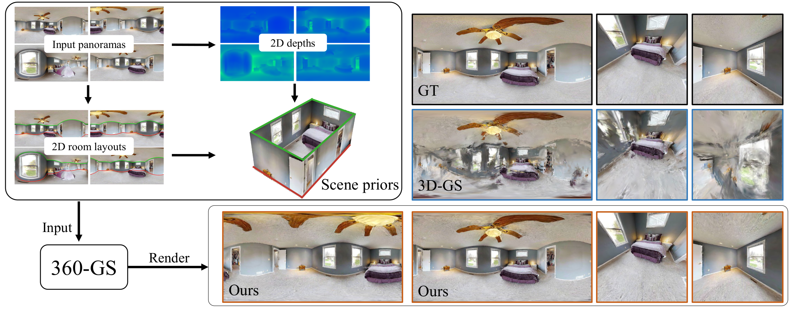

<p align="center">
<h1 align="center"><strong>360-GS: Layout-guided Panoramic Gaussian Splatting For Indoor Roaming</strong></h1>
<h3 align="center">3DV 2024</h3>
<p align="center">
          <span class="author-block">
              <a href="https://scholar.google.com/citations?user=VmPQ6akAAAAJ&hl=zh-CN">Jiayang Bai</a></span>    
            <span class="author-block">
              <a href="https://letianhuang.github.io/">Letian Huang</a></span>    
            <span class="author-block">
              <a href="https://scholar.google.com.hk/citations?user=Sx4PQpQAAAAJ&hl=en">Jie Guo<sup>*</sup></a>
            </span>    
            <span class="author-block">
              <a href="http://www.njumeta.com/">Wen Gong</a>
            </span>    
            <span class="author-block">
              <a href="http://www.njumeta.com/liyq/">Yuanqi Li</a>
            </span>    
            <span class="author-block">
              <a href="https://cs.nju.edu.cn/ywguo/index.htm">Yanwen Guo</a>
            </span>
    <br>
        Nanjing University
</p>

<div align="center">
    <a href=https://arxiv.org/abs/2402.00763></a>  
</div>

</p>

<p align="center">

</p>

## TODO List

- [x] Dataset preparation.

- [x] Release the code.

## Dataset

Please read the [README](DataPreparation/README.md).

## Installation

Clone the repository and create an anaconda environment: 

```shell
git clone https://github.com/LeoDarcy/360GS.git --recursive
cd 360GS/submodules/

SET DISTUTILS_USE_SDK=1 # Windows only
conda env create --file environment.yml
conda activate op43dgs
pip install submodules/diff-gaussian-rasterization-panorama
```

## Train

python train.py -s

while withholding a test set for evaluation, use the `--eval` flag. This way, you can render training/test sets and produce error metrics as follows:

```shell
python train.py -s <path to dataset> --room_id <room_id> --use_layout --use_layout_densify --lambda_dxyz 0.01 --eval 
```

## Acknowledgements

This project is built upon [3DGS](https://github.com/graphdeco-inria/gaussian-splatting). Please follow the license of 3DGS. We thank all the authors for their great work and repos. 

## Citation

If you find this work useful in your research, please cite:

```bibtex
@article{bai2024360,
  title={360-GS: Layout-guided Panoramic Gaussian Splatting For Indoor Roaming},
  author={Bai, Jiayang and Huang, Letian and Guo, Jie and Gong, Wen and Li, Yuanqi and Guo, Yanwen},
  journal={arXiv preprint arXiv:2402.00763},
  year={2024}
}
@article{huang2024erroranalysis3dgaussian,
    title={On the Error Analysis of 3D Gaussian Splatting and an Optimal Projection Strategy},
    author={Letian Huang and Jiayang Bai and Jie Guo and Yuanqi Li and Yanwen Guo},
    journal={arXiv preprint arXiv:2402.00752},
    year={2024}
}
```